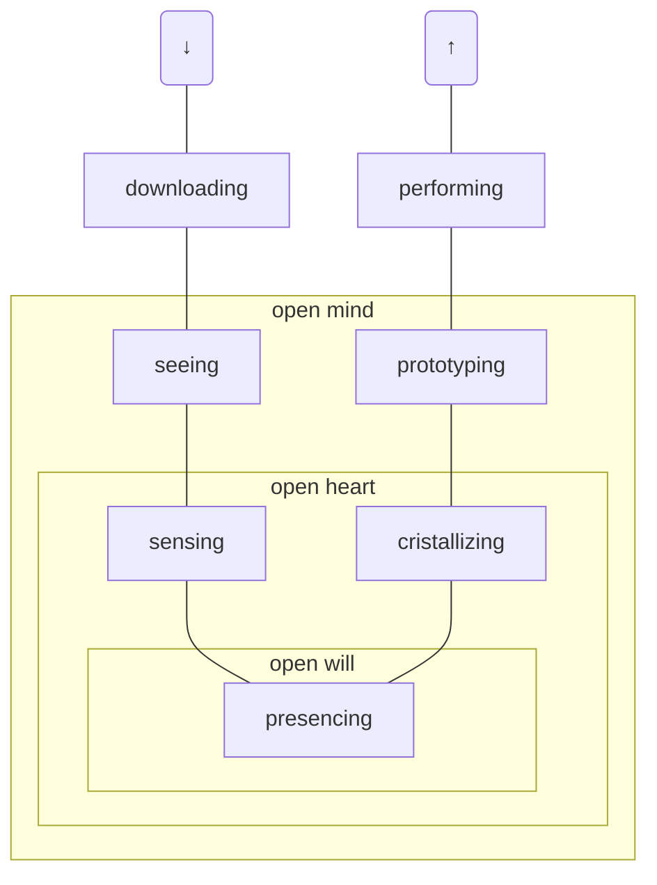

# Neue Narrative

## 1. Macht

### Macht und was sie mit uns macht

Foucault: Macht wird nicht besessen, sie existiert in der Beziehung zwischen Agenten. Macht ist dir Summe der produktiven Wechselwirkungen mit anderen.

Macht ist die Befähigung des eigenen Umfeldes und Ausnutzen von Potentialen – das erfordert Handlungsfähigkeit, Unabhängigkeit.

Kontrolle kann Veränderung nicht managen, nur ein wandlungsfähiges Netzwerk ist stabil.

Beispiel Amazon: Durch kleine, unabhängige Teams (Two Pizza Rule) wird ein *Portfolio of Experiments* aufgebaut.

### Tool: Böse Mächte. Gute Mächte.

Man kann Personen in einer Matrix wenig/viel Macht – progressive/restriktive Nutzung anordnen. Was würdest Du mit aller Macht der Welt anstellen? Was kannst Du davon schon heute umsetzen?

### Machtmomente

Macht hat, wer macht. Eine kleine Idee kann eine große Energie entfalten.

### Tool: Nutze Deine Macht

Level Eins: Nutze die Macht als Kunde, entscheide Dich um, bestelle Extras, …

Level Zwei: Frage nach Empfehlungen, deligiere Entscheidungen.

Level Drei: Versuche eine Leistung zu bekommen, ohne dafür zu zahlen. Liefere Dich der Macht anderer aus.

Level Vier: Alles in Geschäften getan? Dann mache es jetzt auf der Arbeit.

Es gibt drei Typen von Macht:
- Selbstbewusst und initiativ,
- ruhig, aber bestimmt, und
- unsicher und zurückhaltend

Welcher Typ bist Du? Was kannst Du von anderen Typen lernen?

### Macht kommt von machen

Macht hat, wer macht. Aber Macht findet auch in den Köpfen der Beherrschten statt. Tatsächlich kommt Macht (und Ohnmacht) aus etablierten gesellschaftlichen Strukturen. Neue Changen ergeben sich aus dem Aufbrechen vorhandener Strukturen.

### Die Macht der Spielregeln: Wer ist mächtiger, der Spieler oder das Spiel?

Macht scheint immer an Menschen gebunden zu sein, aber sie ist es auch an Gesetzen, Normen und Kultur. Besonders Kultur lässt sich schwer fassen, dazu gehören Zeiterfassungssysteme, Siezen/Duzen, Dresscode und Titel. Besonders Hierarchien sind sehr stark verwurzelt. Sollen sie abgebaut werden, müssen auch Statussymbole, Überwachung und Vorsitzende verschwinden. Auch Mitarbeitende und Externe müssen eingeweiht und überzeugt werden.

### Tool: Das Pistolentoastduell

Die Duellanten haben 30 Sekunden, um sich eine Pistole aus einem Toast zurechtzubeißen. Mit viel Tara ziehen sie ihre Waffen. Eine Jury entscheidet, welches Toast gewinnt.

### Tool: Machtverhältnisse

Wie mächtig bist Du? Bist Du reaktiv oder proaktiv? In Familie, Job, Freundeskreis, mit Fremden, Dir selbst gegebüber, in der Welt, …?

Stelle eine Macht-Matrix auf: Wie wichtig ist Dir Macht in dem Bereich und wie viel Einfluss hast Du? Markiere sowohl Ist- als auch Sollzustand mit einem Pfeil.

### Tool: Machtpotentiale

Es gibt zehn Eigenschaften. Zähle, wie viele davon Du erfüllst. Vergleiche mit anderen aus dem Team oder mit Rollen. Es können auch weitere Eigenschaften gefunden werden. Die Fragen sind:

- männlich
- weiß
- nicht behindert
- Zugang zu Bildung
- ein Elternteil hat studiert
- kein Migrationshintergrund
- die Eltern konnten alle Rechnungen bezahlen
- nie obdachlos gewesen
- mehr als 1100 € Monatsnetto
- Akademiker

### Sorry, Not Sorry

Dale Carnegie: Wer sich entschuldigt, nimmt dem anderen Wind aus dem Segel. Wenn man die eigene Schuld überbetont, erscheint eine harte Reaktion dem anderen unangemessen. Als Übung kann man sich für einen Tag bei jeder Kleinigkeit überschwänglich entschuldigen.

Yao Xiao: Entschuldige Dich nicht, stattdessen bedanke Dich. Dadurch wirst Du vom Bittsteller zum Entscheider, fragt nicht, „bin ich okay?” sondern stellt fest: „Du bist okay.“

### Tool: Getting along, getting ahead: Der Interpersonale Circumplex

Es gibt zwei wichtige soziale Fähigkeiten: *Getting Along* ist das mit anderen Auskommen, verträglich sein; *Getting Ahead* ist Zugang zu Ressourcen, Status und Machtpositionen. Diese sind die zwei Dimensionen der Matrix *Interpersonal Circumplex*.

Generell am erfolgreichsten sind Menschen, die in beiden Dimensionen hohe Werte haben, aber es ist wichtig, auch den Kontext und die Werte der anderen zu beachten.

### Selbstlos schlägt selbstverliebt

Klassischerweise wird Leadership mit einem großen Ego, Selbstverliebtheit und Macht über andere verbunden. *Humble Leadership* ist das Konzept, durch Bescheidenheit und Schwäche stattdessen Einfluss auf andere auszuüben. Das bedeutet aber nicht Selbstzweifel zu haben oder keine Entscheidungen treffen zu können. Ken Blanchard: „People with humility don’t think less of themselves; they just think about themselves less .

### Frauen in Serien

Marie Wilson: „Man kann nicht sein, was man nich sieht.“ Oskar Wilde: „Life imitates art.“ Frauen werden nur dann in Führungspositionen kommen, wenn sie dort in der Kunst vertreten sind.

### Interview Gerhard Huhn

Man sollte seine fünf größten Talente kennen. Sie machen einen einzigartig und die Arbeit, die alle fünf fordert, erfüllt. Die Aufgabe einer Führungskraft ist, Mitarbeiter zur Suche nach den Talenten zu motivieren. Die größten Potentiale liegen in den Schwächen der Menschen.

Ganz wichtig ist ein klares Wertesystem, und die Fähigkeit, nein sagen zu können.

### Check-In und Check-Out

Eine Arbeit sollte mit einem Check-In beginnen und mit einem Check-Out aufhören.

## 2. Sinn

Das Popcornprinzip in Meetings (vor allem Check-Ins) beschreibt, dass die Person anfängt, bei der zuerst etwas aufpoppt.

### Was ist Sinn?

Yuval Harari (*Homo Deus*): Wenn man Macht abgibt (zum Beispiel an Götter), kann man leichter einen Sinn vermuten. Wer Macht hat, muss den Sinn selbst finden.

Tool von Stephen Covey (*The 7 Habits of Highly Effective People*): Denke vom Ende her. 
Stelle Dir Deine Beerdigung vor, auf der vier Menschen reden: Aus Deiner Familie, ein Freund, ein Arbeitskollege und jemand aus einem Verein/einer Community. Was sollen diese Leute sagen?

In einer Stammesgesellschaft liegt der Sinn in (dem Überleben) der Gruppe. Heute haben Organisationen selten einen Sinn, Positives zu bewirken. Arbeit hat dann Sinn, wenn das Unternehmen einen Sinn verfolgt. *Reinventing Organizations* von Frederic Laloux versucht Unternehmen bei der Sinnfindung zu helfen.

### Der WOL-Circle

*Working out Loud* (John Stepper) ist das Aufbauen eines Sinn-Netzwerkes. Hier treffen sich kleine Gruppen in WOL-Circles, um persönliche (nicht unbedingt arbeitsbezogene) Ziele zu definieren und einander zu unterstützen. Dies kann als Anfang zu einem Umdenken dienen, aber nicht als Endpunkt. Ein WOL-Circle dauert 12 Wochen:

1. Entscheide Dich für ein Ziel und erstelle eine Liste von für das Ziel relevanten Personen.
2. Welche Beiträge kannst Du für die Personen auf Deiner Beziehungsliste leisten?
3. Passe das Zeitmanagement an, füge weitere Kontakte hinzu, erstelle eine andere Art von Beiträgen.
4. Errege Aufmerksamkeit für Deine Beiträge. Überlege, wie Du sie anbietest, die Form kann viel ausmachen. Sei empathisch.
5. Was hast Du selbst anzubieten?
6. Verbessere Deine Sichtbarkeit.
7. Formuliere eine Vision in einem Brief an Dich selbst vom dem Ich, das das Ziel bereits erreicht hat.
8. Werde Systematischer.
9. Erschaffe etwas Einfaches, aber Wirkungsvolles.
10. Mache es zur Gewohnheit.
11. Stelle Dir die Möglichkeiten vor.
12. Reflexion und Feiern.

### Tool: Sinnprotokolle

Beantworte die folgenden Fragen:

- Was war das sinnloseste/sinnvollste, was Du je gemacht hast?
- Was bedeutet, Zeit sinnvoll zu nutzen?
- Kann man Zeit überhaupt nicht sinnvoll nutzen?
- Wen bewunderst Du dafür etwas Sinnvolles zu tun? Was kannst Du von der Person lernen?
- Welchen sinnvollen Beitrag wills Du am Ende Deines Lebens geleistet haben? Welchen heute Abend?
- Was fehlt Dir um glücklich zu sein?
- Was hast Du bereits, das Dich glücklich macht?
- Welchem noch lebenden Menschen bist Du besonders dankbar?
- Wie könntest Du Deine Dankbarkeit zeigen?

### Tool: Sinntagebuch

Am Ende jeden Arbeitstages liste möglichst alle Deine Tätigkeiten des Tages auf (>80 % der Arbeitszeit) und überlege Dir, warum Du sie gemacht hast. Es gibt dabei drei Stufen: die banale Antwort, der tiefere Grund, der Sinn.

(Anmerkung: Das könnte gut in Kombination mit ABCDE/1-3-5 und Zeit- und Output-Measurement funktionieren, vielleicht als Spreadsheet)

### Getting Things Done

Der GTD-Workflow besteht aus Sammeln (alle Action Items kommen an einen zentralen Ort), Verarbeiten (Formulierung einer konkreten Aufgabe und 2-Minuten-Regel), Organisieren/Kategorisieren (in Projekte, Deadlines, Kontexte, …), Durchsehen (wenn man Zeit hat, gucken, welcher nächster Punkt sich anbietet) und Erledigen (die Aufgabe machen, die im aktuellen Kontext am besten passt).

Man bekommt einen klaren Geist über die folgenden Dinge:

- Vision: Was will ich in drei bis fünf Jahren erreicht haben?
- Ziele: Was muss ich in den näcshten 12 Monaten erreichen?
- Private und berufliche Rollen
- Welche Projekte habe ich?
- Was sollte ich als nächstes tun?

Sei visionär und übernimm die Kontrolle, um die Vision zu verwirklichen.

### Tool: Purpose first

Es gibt fünf Stufen, die aufeinander aufbauen, und die vom Unternehmen als ganzes durchlaufen werden müssen (und von jeder Abteilung und von jeder Person):

1. Purpose: Wofür werden wir gebraucht? Wie können wir dem dienen? Was ist der tierere Sinn?
2. Vision: Wie soll die Welt in einigen Jahren konkret aussehen?
3. Strategie: Was ist der aussichtsreichste Weg, um die Vision zu verwirklichen?
4. Ziele: Was kann man in den nächsten Wochen und Monaten erreichen, um die Strategie zu verfolgen?
5. Taktiken: Wie erreichen wir das nächste Ziel am besten?
 
Mission (Bonus): Als Ersatz oder Ergänzung zum Purpose. Was will das Unternehmen sein? Wofür wollen wir gebraucht werden?

### Tool: Die Kopfstandmethode

Die Methode dauert eine Stunde, braucht sechst Personen und zwei Arten von Post-Its. Es ist eine Form des Brainstormings.

1. Ausgangsfrage stellen und umdrehen. „Wie schaffen wir es, die Welt kaputter zu machen?“
2. Drei Minuten in Stille denken, 20 Minuten in der Gruppe vorstellen und ergänzen.
3. Ideen clustern, Überschriften finden und weiter ergänzen.
4. Ideen auf die Füße stellen: Alle negativen Ideen werden ins Positive verkehrt, dafür die anderen Post-Its nutzen.
5. Priorisieren: Bildet drei Cluster: Morgen umsetzbar, in drei Monaten umsetzbar, in einem Jahr umsetzbar. Seid ehrgeizig. Wählt die besten fünf Ideen aus.
6. Findet für jede Idee einen Verantwortlichen.

### Eigentum verpflichtet

Absentee Ownership bedeutet, dass die Arbeiter und Verantwortlichen nicht die Investoren, Eigentümer und Gewinner eines Unternehmens sind.

Die Purpose-Stiftung trägt 1 % der Anteile eines Unternehmens und hat ein Vetorecht. Dadurch haben Investoren nur eingeschränktes Stimmrecht, der Gewinn bleibt beim Unternehmen.

### Tool: Das Purpose-Turnier

Methode zum Finden des Purpose eines Teams, Bereichs oder ganzen (kleineren) Unternehmens.

1. Rahmen klären: Wessen Purpose soll geklärt werden? Gibt es schon einen Rahmen durch die umgebende Struktur?
2. Stakeholder-Map: Welche Personen, Gruppen und abstrakten Entitäten („die Umwelt”) sind betroffen?
3. Mehrwert-Cluster: Nutzt die Stakeholder, um Arten von Mehrwert zu formulieren, die Ihr schafft. Clustert und labelt sie. (Ziel: 5–7 Cluster)
4. Individuelle Purpose-Skizze: Sucht einzeln nach einem „Wir …“-Satz, der alle Cluster beschreibt. Hilfreich ist das Why-How-What-Format: Dort wird der Satz in Purpose (why), Umsetzung (how) und konkrete Arbeit (what) aufgeteilt.
5. Das Turnier: Man trifft sich in Partnerarbeit, um einander die beiden Sätze vorzustellen und zu besprechen. Dann werden beide Sätze verworfen und zu zweit ein neuer Satz erarbeitet. Einer der Partner vertritt diesen Satz in der nächsten Runde, der andere wird zum Zuschauer und kann nur noch Ideen einwerfen, aber nicht mehr diskutieren.
6. Entscheidung und Abschluss: Das Ergebnis wird noch einmal besprochen. Jeder darf noch Probleme anmerken, die möglichst gelöst werden.

### Tool: Ikigai

Nimm Dir 60 Minuten und beantworte die vier Ikigai-Fragen für Dich. In Partnerarbeit ist es leichter: Eine Person erzählt, die andere führt durch die Fragen und macht Notizen. Assoziiert, keine Angst vor unfertigen Gedanken. Nach den vier Fragen beantwortet die fünfte: „Was könnte mein Ikigai sein?”

### Warum es an der Zeit für ein Grundeinkommen ist

Das Recht auf Arbeit ist ein Menschenrecht. Tatsächlich wird es praktisch jedoch als Pflicht wahrgenommen. Durch die Automatisierung werden viele Arbeiten wegfallen, die nicht durch andere ersetzt werden. Aktuell beginnt die Postindustrialisierung, durch die viele Arbeitsplätze wegfallen, ohne dass es eine adäquate Versorgung der Menschen gibt. Es wird davon ausgegangen, dass langfristig 20 % der Arbeitskräfte die heutige Produktivität halten können. Ein Grundeinkommen schafft die Sicherheit zur Kreativität – und da liegen die Berufe, die länger bleiben werden. Außerdem sollten Menschen mehr Zeit für Müßiggang haben.

### Purpose-Beratung

Beratungsfirmen verkaufen Purpose, ohne echte Veränderung zu bewirken. Statt Sustainability gibt es Greenwashing, statt neuer Arbeit gibt es „alte Arbeit mit Internetanschluss“.

### Check-Out: Drei Prozent

Um einen substantiellen Wandel anzustoßen, benötigt man die aktive (!) Unterstützung von drei bis fünf Prozent der Bevölkerung.

### Umschlag: Meetings zählen

Wie viele Meetings hast Du im Monat? Wie viele davon waren unnötig, haben nichts bewirkt, hatten keinen Sinn? Der Rest ist die Anzahl der sinnvollen Meetings mit Einfluss.

## 3. Führung

### Die Zeit der Held*innen ist vorbei

Führung ist nicht Management. Management bezieht sich auf die Vergangenheit, auf das, was schon funktioniert. Führungskräfte brauchen vor allem Zukunkftskompetenz: Man kann Zukunft nicht planen, man kann nur lernen, auf sie zu reagieren. Dafür braucht es klarheit über die eigenen Werte und Ziele, Experimente und empirische Validation, und ein bisschen Paranoia vor Gefahren.

### Tool: Führung auf dem Seziertisch

Was ist Führung überhaupt bei uns? Was verstehen wir darunter?

1. Führungskräfte identifizieren: Diese müssen bereit sein, ihre Rolle zu untersuchen.
2. Welche Führungsaufgaben übernehmen die Führungskräfte: Feedbackgespräche, Konfliktklärung, …
3. Clustern
4. Sinn und Zweck der Führungstätigkeiten. Was ist das Ideal, das durch diese Arbeiten angestrebt wird? Die Rolle wird solange benötigt, wie das Ideal nicht erreicht ist.
5. Rollen bewerten: Was kostet wie viel Zeit? Was bringt dem Team wie viel, was wäre die ideale Zeitverteilung?
6. Gibt es Aufgaben, die besser deligiert werden sollten? Oder die unnötig sind?

### Tool: Führungsprotokolle

- Was ist schlimmer: keine Führung oder schlechte Führung?
- Gibt es eine dritte Alternative?
- Wo übernehme ich Führung?
- Wo drücke ich mich vor der Führungsverantwortung?
- Welches Verhältnis dürfen/sollten Führung und Ego zueinander haben?
- Wie sah gute Führung früher aus? Wie in der Zukunft?
- Sind Frauen oder Männer bessere Führungskräfte? Warum ist das Geschlecht von Bedeutung?
- Welche Führungsperson inspiriert dich? Was hintert dich daran, zu sein wie sie?

### Distributed Leadership

Es gibt drei Prototypen der Führung: Leadership (Vision und Innovation), Management (Umsetzung von Prozessen) und Coaching (Entwicklung der Mitarbeiter:innen fördern)

Führungsaufgaben sind zu viel, um von einer einzigen Person getragen zu werden, deswegen ist *distributed Leadership* das Zukunftsmodell: Innovation ist schnellebiger geworden (nicht eine Strategieklausur jährlich, sondern kontinuierliche Anpassungen), Self-Management (von Individuen und Arbeitsgruppen) ist wichtiger, die Managerposition wird manchmal sogar unnötig, oder wandelt sich zu einem Facilitator. Der Coach sollte nicht Leistungsbewertung übernehmen, das ist eine weitere Rolle. Rollen sind flexibel. Nutze auch das Tool *Führung auf dem Seziertisch*.

### Ohne Anfassen

Start-up Komoot ist remote-first. Dazu muss Führung von Kontrolle entkoppelt werden.

Problem: Es gibt weniger Zufallsbegegnungen; eine Teillösung: Bots losen jede Woche Partner aus, die einander einmal treffen sollen (physisch oder digital); private Themen werden ausdrücklich befürwortet. Das wird allerdings nicht kontrolliert.

Dreimal im Jahr gibt es ein Gathering mit Paneldiskussionen, Strategieentscheidungen.

Wöchentlich gibt es ein Meeting, in dem alle von ihrer Arbeit erzählen, wie es der Vision des Unternehmens beiträgt, und was ansteht. 30 Personen in 90 Minuten. Es gibt Templates für Slides, die genutzt werden müssen. Erste Slide ist eine Weltkarte, in der alle eintragen, wo sie gerade sind, oder im Urlaub oder krank.

### Tool: Integratives Entscheiden

Tool zur moderierten Entscheidungsfindung. Hier geht es ums *Ich*, nicht ums *Wir.* Die Schritte sind:

1. Eine Person beschreibt ihre (eigene!) Spannung.
2. Die Person gibt einen Lösungsvorschlag.
3. Fragen zum Vorschlag werden gestellt. Regel: Informationen holen, nicht senden. Es muss nicht unbedingt Antworten geben.
4. Alle äußern ihre Meinung oder Ergänzungen; keine Diskussionen.
5. Der:die Initiator:in präzisiert und passt den Vorschlag an.
6. Gibt es Einwände? Nicht bessere Ideen, sondern Vetos.
7. Integration der Einwände – hauptsächlich durch ein Gespräch zwischen Einwender:in und Initiator:in.
8. Die erarbeitete Lösung wird ausprobiert, sobald alle Einwände behandelt sind.

### Panik in der Pyramide

Es gibt vier Richtungen von Führung: nach unten, nach oben, lateral (kooperativ), und Selbstführung

### Theory U und der blinde Fleck von Führung

Führung von der Zukunft her passiert in einem U:

Es gibt drei innere Führungsinstrumente: *open mind, open heart, open will* oder *couriosity, compassion, courage*. Open mind ist die Offenheit gegenüber Neuem und Erkundungstrieb. Open heart ist das Einfühlungsvermögen in andere, vor allem Mitarbeiter, aber weiterhin funktionsfähig zu bleiben; außerdem das Vertrauen auf das Bauchgefühl. Open will ist Commitment und Wahrnehmung der Hier und Jetzt.

Im linken Ast geht sind die Phasen, um ins Presencing zu kommen, das Gefühl für eine Innovation (Thin-Slicing von Zukunft): Innehalten, Umwenden, Loslassen. Der rechte Ast ist der Prozess, aus dem Gefühl etwas zu entwickeln: Kommen lassen, Hervorbringen, Verkörpern.

### Tool: Listening Walk

Partnerübung mit einer Fragestellung. Man geht spazieren

1. Person A erzählt fünf Minuten lang, was in ihr bei der Frage resoniert. B hört zu und versucht, tief zuzuhören. Es gibt vier Ebenen:
   1. Downloading: vorhandene Einstellungen bestätigen.
   2. Faktisches Zuhören: andere Einstellungen wahrnehmen.
   3. Empathisches Zuhören: die Welt aus den Augen des anderen sehen.
   4. Schöpferisches Zuhören: Intention des anderen wahrnehmen; was will die andere Person schaffen? Als Geburtshelfer:in dienen.
2. Fünf Minuten schweigen und weiter gehen.
3. Rollentausch; B muss nicht auf A eingehen.
4. Wieder fünf Minuten schweigen.
5. Zehn Minuten Reflexion und Austausch über wichtige Momente; eventuell Austausch in einer größeren Gruppe.

### Leader, die Wölkchen malen

Bob Ross ist ein *postheroischer Leader*; er ist kein Held, der von oben predigt, sondern ein Vorbild. Er hat Follower und inspieriert sie, steckt sie mit seinen Ideen an. Er lässt viel Freiraum, es gibt nur einige wenige *simple rules*. Fehler sind erlaubt, glückliche Zufälle werden genutzt („Luck Management“). Er bietet Sicherheit und ermutigt zu ein bisschen Unvernunft.

### Googles Search Inside Yourself

Es gibt einen Workshop von Google, zum Hier und Jetzt zu kommen, Präsenz gegenüber anderen und sich selbst zu zeigen. Es gibt auch ein Buch dazu. Einige Learnings:

1. Nicht nur zuhören, sondern achtsam zuhören. Nicht Lösungen anbieten, sondern den anderen zu einer eigenen Lösung begleiten.
2. Vor Gesprächen die Intentionen der Teilnehmer:innen klären.
3. Innehalten, Selbstempathie üben.
4. Im Zweifelsfall dreimal tief durchatmen.
5. Ein positives Tagebuch führen: Was muss heute passieren, damit der Tag gut wird?
6. Bitte um eine ruhige Minute, um ankommen zu können.
7. Halte eine gesunde Distanz zu Deinen Gedanken und Gefühlen.
8. Habe Compassion mit anderen; sie sind auch nur Menschen und wenn jemand eine negative Emotion in Dir auslöst, will er meistens nur selbst glücklich sein.
9. Sieh von außen auf Dich selbst. Schreibe eventuell.
10. Nimm alles mit Humor.

### Tool: Das integrale Modell

Transformationsmanagement. Es gibt zwei Dimensionen: Ich–Wir und Innen–Außen. Daraus ergibt sich eine Matrix:

- Ich, Innen: Mindset, Haltung
- Ich, Außen: Verhalten, Methoden
- Wir, Innen: Kultur
- Wir, Außen: Prozesse, Strukturen

Beim Change Management müssen alle vier Bereiche gleichzeitig beachtet werden.

### Wenn deine Chefin dein Coach ist

Emotionale Intelligenz ist wichtiger als fachliche. Statt zu sagen: „Mache X, um Y zu erreichen“, sage: „Im Kontext Z ist es für das Unternehmen wichtig, Y zu erreichen.“ Das X kann der Mitarbeiter selbst finden.

Eine Führungskraft muss eine Richtung vorgeben. Dazu muss sie das Warum kennen.

Als Coach braucht man ein Verständnis von den Stärken der Mitarbeiter:innen.

Man muss präsent sein, Herausforderungen, Erfolge und Verhalten beobachten, und anderen zuhören.

Es benötigt institutionaliserte Feedback-Prozesse wie Peer-Mentoring (Austausch unter Führungskräften) oder 360-Grad-Feedback. Feedback muss empathisch und direkt sein, sonst ist es aggressiv, manipulativ, oder zerstörerisch. Feedback muss gegeben und angefragt werden.

Eine Führungskraft muss die richtigen Fragen kennen und stellen. Die Antworten muss sie nicht kennen, und darf auch keine vorgeben.

### Die Entkopplung überwinden: Wie interne Kommunikation wirklich durchdringt

Es gibt so viel Informationsfluss, dass am Ende nur Rauschen wahrzunehmen ist. Oft bestimmt Hierarchie daüber, was kommuniziert wird – ein Fehler. Es gibt vier Schritte im Prozess der Kommunikationsleitung:

1. Relevanz: Informiere über das, was die Empfänger der Nachricht interessiert.
2. Biss: Kommuniziere klar, einfach und in Geschichten (Versuch und Irrtum, Hürden, Herausforderungen, Happy End oder Tragödie). Reibung ist interessant.
3. Zielgruppenkenntnis: Wen soll die Nachricht erreichen, und wie passiert das? Nicht der Mitarbeiter finden den Inhalt, sondern der Inhalt den Mitarbeiter.
4. Dialog: Kommunikation funktioniert in alle Richtungen. Beispiel: Sprechstunde mit dem CEO.

Diese Schritte sparen Zeit und Geld, da keine nutzlose Kommunikation mehr stattfindet.

### Tool: Richtig schwierige Gespräche führen

**Vorbereitung:** Schwierige Gespräche immer persönlich führen. Ziel ist, eine Spannung zu lösen oder eine Beziehung zu verbessern. Das Gespräch wird geführt, wenn es schon emotionell verarbeitet, aber noch präsent ist. Wird ein Mediator benötigt? Der Ort ist neutral und sicher.

**Spannung Beschreibung:** Nach Rosenberg Fakten, Gefühle und Bedürfnisse kommunizieren. Eine Vision haben (die muss man nicht aussprechen) und eine Bitte (keine Forderung!) formulieren.

**Gesprächsverlauf:**
1. Einverständnis einholen
2. Check-In
3. Spannung beschreiben
4. Andere Person spiegelt. Missverständnisse beseitigen
5. Die Bitte formulieren
6. Wieder spiegeln des anderen
7. Reaktion des anderen auf die Bitte
8. Selbst spiegeln
9. Nächste Schritte festlegen, Wichtiges festhalten.
10. Check-Out: Wie kann ich in Zukunft solche Gespräche besser führen?

### Wie Organisationen sich mit Holacray und Scrum selbst führen können

Holacray und Scrum sind Prozesse mittels derer ein Team sich selbst führen kann.

**Holacracy:** Eine Person hat keine feste Position/Stelle, sondern flexibel eine Reihe an Rollen. Rollen können sich auch ändern. Es gibt keine Vorgabe, wie Rollen auszufüllen seien, orientiert wird sich am Purpose und der Holacracy-Verfassung.

Das Unternehmen teilt sich in verschachtelte *Kreise* auf. Jeder Kreis hat:

- Einen *Lead Link*, der die Interessen des Elternkreises vertritt. Er kennt Purpose, Ziele und Strategien eines Kreises. Defaultmäßig verwaltet er Rollen, aber das kann angepasst werden. Er ist jedoch kein Manager, er bestimmt keine Vorgehensweisen.
- Einen *Rep Link*, der einen Kreis beim Elter vertritt. Er fordert Ressourcen an und trägt Bedürfnisse weiter.
- Ein *Facilitator* überwacht die Regeln, moderiert Meetings, ist neutral.
- Der *Secretary* dokumentiert, legt Meetings fest, legt die Verfassung aus.

Weitere Rollen gibt sich jeder Kreis nach Bedarf selbst (zum Beispiel Vertreter:innen in Geschwisterkreisen). Lead und Rep dürfen nicht von derselben Person gestellt werden. Außerdem schließen sich Lead und Facilitator und Facilitator und Secretary aus.

*Governance-Meetings* werden genutzt, um die innere Struktur eines Kreises zu überarbeiten. *Tactical-Meetings* dienen der Synchronisation mit anderen Kreisen. Kreise legen Rollen selbst fest und besetzen sie selbst – mithilfe des Personal-Kreises.

Leadership kann aufgeteilt werden, zum Beispiel in *People Lead* als (gewählte) formale Führungskraft mit Leistungsbewertung und Personalentscheidungen, *Mentor*, von jedem Mitglied persönlich gewählt, *Vertrauensperson* für persönliche Probleme – auch individuell gewählt.

> Wer dir folgt, macht dich zur Führungskraft

**Scrum:** In Scrum sind Sprints die Einheiten der Arbeit. Es gibt einen *Product Owner*, einen *Scrum Master* und das *Delivery Team*.

### Richtig miese Führung

Es gibt drei besonders schlechte Arten zu führen:

1. *Narzisstisch:* Seine Ideen sind die besten, andere egal. Er schnappt sich alle Lorbeeren und macht andere klein.
2. *Caretaker:* Entmündigt andere, macht sie abhängig und kontrolliert sie. Er ist der gütige Held. Oft auch ein Micromanager.
3. *Ehrgeizig:* Jung, aber besserwisserisch; erwartet Leistung von allen, hat eine lange Bucketlist.